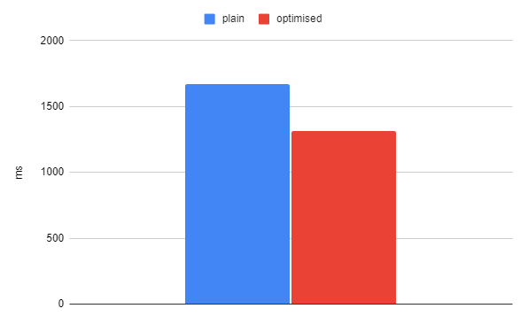
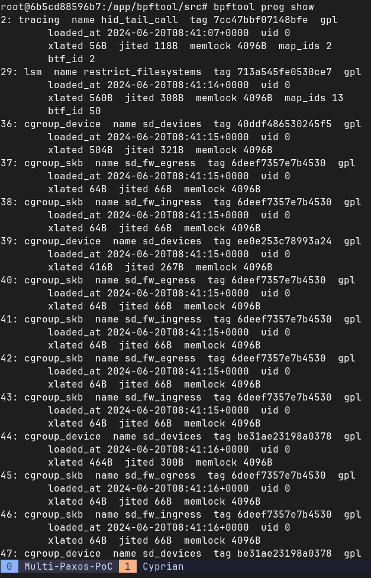
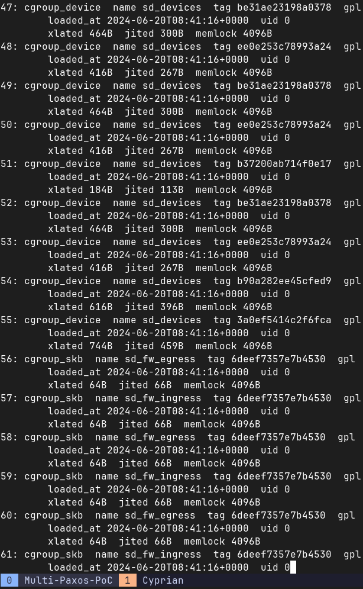
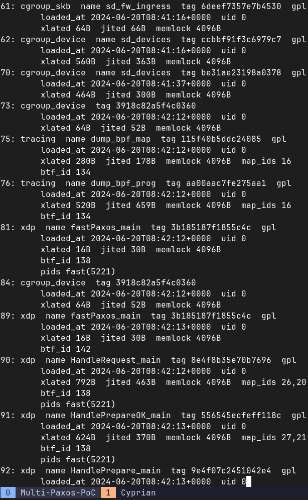
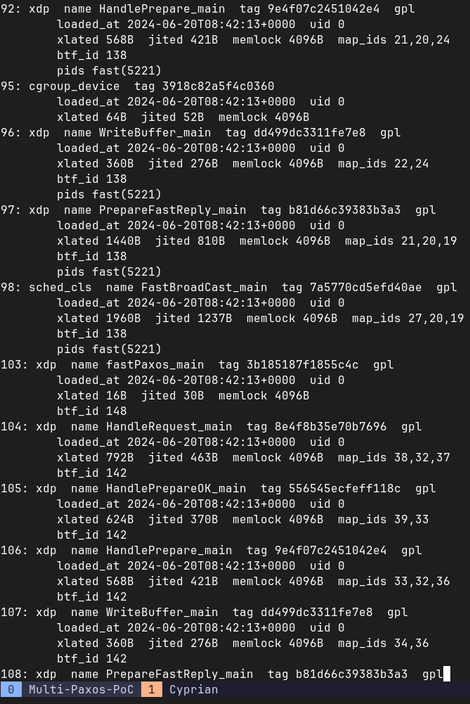
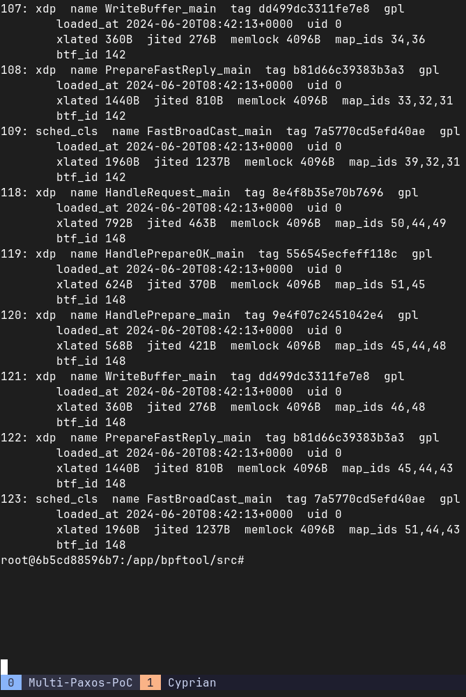

# Multi-Paxos-PoC
Proof of concept of Multi-Paxos Electrode optimization for Future Internet Technologies course at AGH University of Cracow 2023/24.

## Inctroduction

After many trials and battles with flags for Electrode applications, we decided to measure impact only for frist optimization flag, TC_BROADCAST.

In Paxos protocols, one-to-all message broadcasting is widely used:
* the leader node sends preparation messages to all follower nodes 
* after receiving enough acknowledgments from followers the leader node sends commit messages to all follower nodes

To implement the above message broadcasting, the most common way is sending the same message multiple times in the user space to different destinations. However, the overhead (i.e., user-kernel crossing and kernel networking stack traversing) of this implementation on the leader node increases linearly as the number of followers increases, while the overhead on each follower node remains constant (so the leader node becomes the system bottleneck).

Electrode provides a flexible host-based broadcasting solution by utilizing eBPF on the TC hook. Here, we require the eBPF program that implements broadcasting operations to attach to the TC hook, because only the TC hook can intercept and process outgoing packets (§2.2). After attaching the eBPF program, user-space applications can call the elec_broadcast() function specified sock_fd, message, and a list of destination IPs to broadcast the message to these destinations through the socket.

Under the hood, the eBPF program makes clones of the message packet using the bpf_clone_redirect() helper function, modifies the destination addresses of cloned packets accordingly, and sends these packets out. The benefit of cloning packets and broadcasting in the kernel compared with sending the same message multiple times in the user space is that we only need to cross the user-kernel boundary and traverse the UDP and socket layer once.

## Structure of the repository

In directory `docs` you can find our preliminary understanding of two NSDI conferences and SIGCOMM on the practical use of the eBPF service to optimize the performance of applications or other services.

In directory `Electrode` you can find implementation of Multi-Paxos algorithm with Electrode optimization, cloned from [its author repository](https://github.com/Electrode-NSDI23/Electrode). The implementation is based on the paper [Multi-Paxos with Electrodes: A Framework for Optimizing State Machine Replication Protocols](https://arxiv.org/abs/2202.13194), which we have considered to be the most interesting and promising for our proof of concept, so we decide to reproduce it on few different scenarios.

We decided to reproduce the results of the paper using Docker images and Docker Compose orchestration. In the root directory you can find Dockerfiles and Docker Compose files for each scenario. For each scenario you need to build the Docker image and run the Docker Compose file. The scenarios are:
* `scenario3` - three replicas, one client
```
docker build -t electrode:scenario3 -f ./scenario3/Dockerfile . 
docker compose -f ./scenario3/docker-compose.yaml up
# to cleanup containers after running the scenario
docker compose -f ./scenario3/docker-compose.yaml down
```
* `scenario5` - five replicas, one client
```
docker build -t electrode:scenario5 -f ./scenario5/Dockerfile . 
docker compose -f ./scenario5/docker-compose.yaml up
# to cleanup containers after running the scenario
docker compose -f ./scenario5/docker-compose.yaml down
```
* `scenario7` - seven replicas, one client
```
docker build -t electrode:scenario7 -f ./scenario7/Dockerfile . 
docker compose -f ./scenario7/docker-compose.yaml up
# to cleanup containers after running the scenario
docker compose -f ./scenario7/docker-compose.yaml down
```

Each scenario directory contains:
* `Dockerfile` - Dockerfile for building the Docker image
* `docker-compose.yaml` - Docker Compose file for running the scenario with according number of replicas
* `config.txt` - Text file with replicas IP addresses and ports (container names instead of IP addresses thanks to Docker Compose)
* `fast_user.c` - C script with replicas MAC addresses on line 281
* `fast_common.h` - Header file with cluster size on line 17

All Dockerfiles have in general the same structure:
* Install required apt packages on Ubuntu 20.04
* Clone the Electrode repository and files specific for the scenario
* Build the Electrode
* Configure NIC and irqbalance
* Execute script with:
    * running `fast` script on NIC 
    * command you specify in the Docker Compose file

Client container after proper initialization will send requests to the replicas and measure the latency of the responses. The results will be visible in the terminal.

## Results

For 3 replicas, the optimization makes latency drop from 1670ms to 1314ms, which is approximately 21% acceleration.



To check whether the eBPF program is attached to the TC hook, you can go inside any replica and use the following command:
```
docker exec -it replica1 /bin/bash
bpftool prog show
```
This will display a list of all eBPF programs currently loaded into the kernel. Below are all the programs we loaded during our experiments.







Unfortunately, we faced issues with 5 and 7 replicas scenarios. After launching the scenario, the client container warms up correctly, but then replicas start being confused about request and suddenly part of them (with higher indexes) errors with `Segmentation fault`. We tried to debug the issue, but we didn't manage to find the root cause. We suspect that the issue is related to the kernel version (Docker container takes the host kernel version) or the wrong combination of steps we made in the Dockerfile.

We also tried deploying solution on AWS (to overpass the kernel version issue), but we faced the same issue as in the Docker container (installing kernel headers and rebooting kernel didn't help).

## Conclusion

We managed to reproduce the results of the paper for the scenario with 3 replicas. We faced issues with 5 and 7 replicas scenarios, which we suspect are related to the kernel version or the wrong combination of steps in the Dockerfile. We also tried deploying the solution on AWS, but we faced the same issue as in the Docker container. The other option that may work is to use local Virtual Machines with proper kernel version, but we didn't have time to try it.
